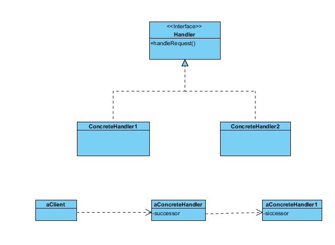
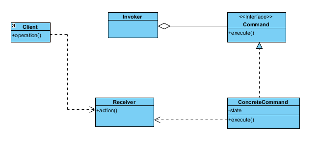
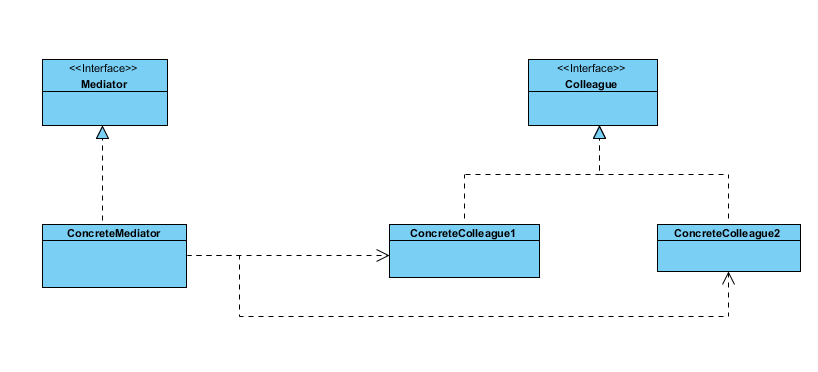
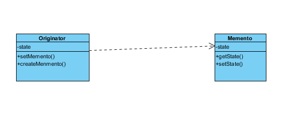
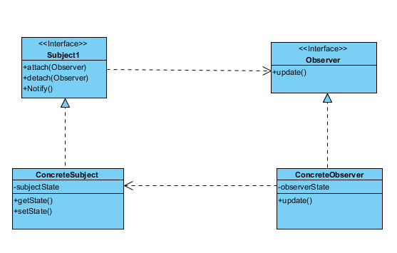
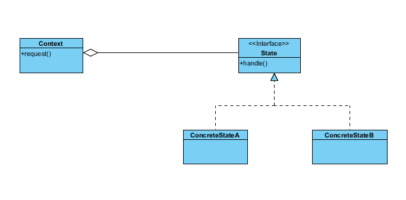
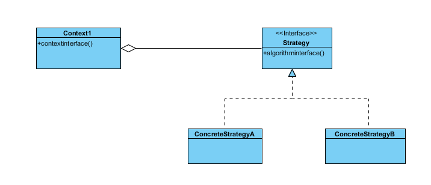
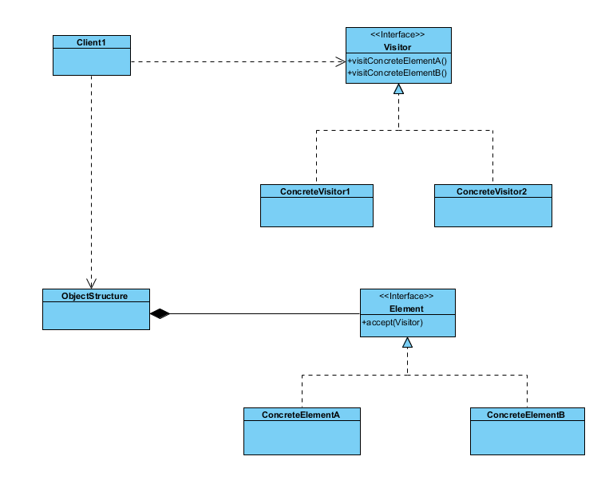

# 设计模式----行为模式

[TOC]

设计算法和对象间职责的分配。行为模式描述对象或类的模式，还描述它们之间的通信模式。这些模式刻划了在运行时难以跟踪的复杂的控制流。将注意从控制流转移到对象间的联系方式上来。
行为类模式  继承
行为对象模式  对象复合

## 一、职责链（Chain Of Resopnsibility）

**目的**
使多个对象都有机会处理请求，从而避免请求的发送者和接收者之间的耦合关系。将这些对象连成一条链，并沿着这条链传递该请求，直到一个对象处理它为止。

**结构类图**

**优点**

1. 降低耦合度
2. 增强了给对象指派职责的灵活性

**缺点**

1. 不保证被接受

## 二、命令（Command）

**意图**

将一个请求封装成一个对象，从而使你可用不同的请求对客户进行参数化；对请求排队或记录请求日志，以及支持可撤销的操作。
Command模式是回调机制的一个面向对象的替代品。
Command模式将调用操作的对象与知道如何实现该操作的对象解耦；

**结构类图**

## 三、解释器（Interpreter）

**意图**
给定一个语言，定义它的文法的一种表示，并定义一个解释器，这个解释器使用该表示来解释语言的句子。

**结构类图**

## 四、迭代器（Iterator）

**意图**
提供一种方法顺序访问一个聚合对象中各个元素，而又不需暴露该对象的内部结构
**结构类图**

## 五、中介者（Mediator）

**意图**
用一个中介对象来封装一系列的对象交互。中介者使各对象不需要显式地相互引用，从而使其耦合松散，而且可以独立地改变它们之间的交互。

依赖行为的关系封装。

**结构类图**

## 六、备忘录（Memento）

**意图**
在不破坏封装性的前提下，捕获一个对象的内部状态，并在该对象之外保存这个状态。这样以后就可将该对象恢复到原先保存的状态。

**结构类图**

## 七、观察者（Observer）

**意图**
定义对象间的一种一对多的依赖关系，当一个对象的状态发生改变时，所有依赖于它的对象都得到通知并被自动更新。
**结构类图**

## 八、状态（State）

**意图**
允许一个对象在其内部状态改变是改变它的行为。对象看来似乎修改了它的类。
**结构类图**

## 九、策略（Strategy）
**意图**
定义一系列算法，把他们一个个封装起来，并且使他们可相互替换。
**结构类图**

## 十、模板方法（Template Method）
**意图**
定义一个操作中的算法的骨架，而将一些步骤延迟到子类中。
**结构类图**

## 十一、访问者（Visitor）

**意图**
表示一个作用于某对象结构中的个元素的操作。它使你可以在不改变个元素的类的前提下定义作用于这些元素的新操作。
**结构类图**
