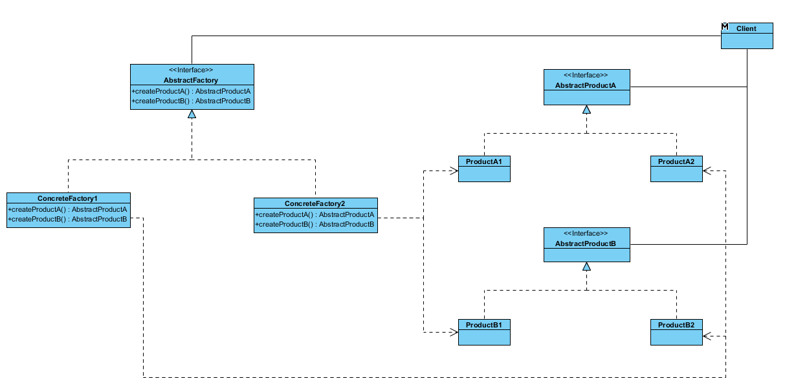
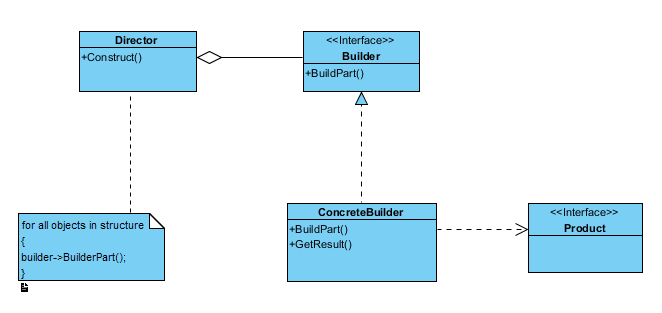
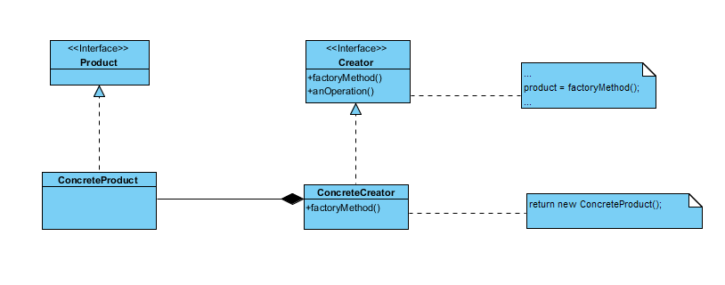
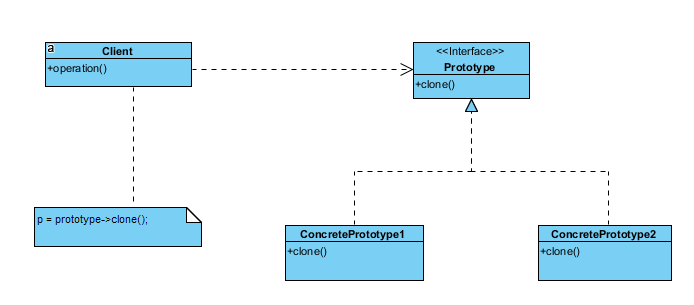
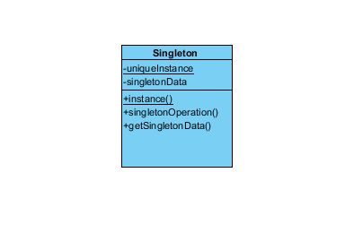

# 设计模式---- 创建型模式

[TOC]

## 一、抽象工厂模式(Abstract Factory)

**目的**

**结构类图**

## 二、生成者/建造者模式(Builder)

**目的**

**结构类图**

## 三、工厂方法模式（Factory Method）

**结构类图**

## 四、原型模式（Prototype）

**结构类图**

## 五、单例模式（Singleton）

**结构类图**
