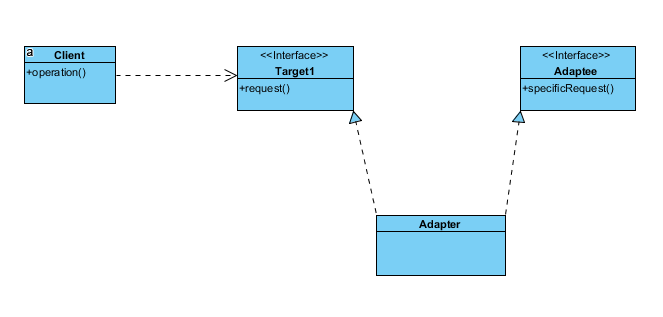
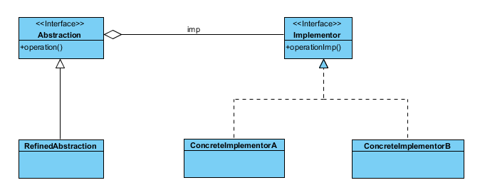
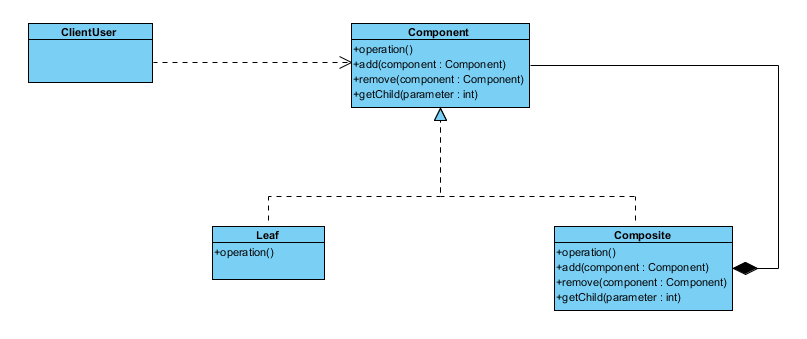
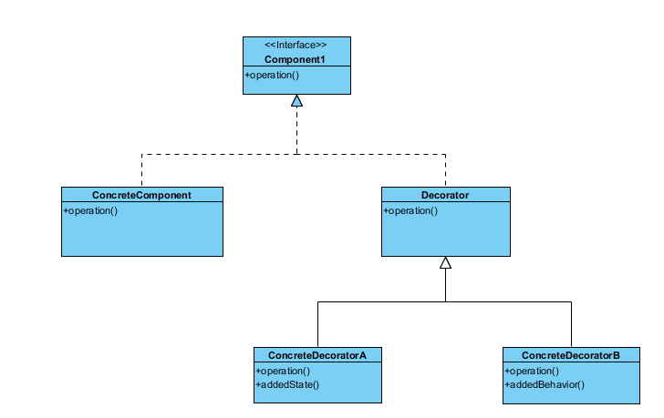
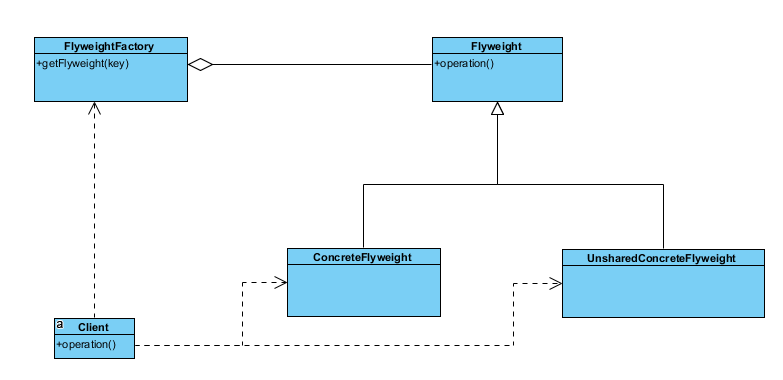
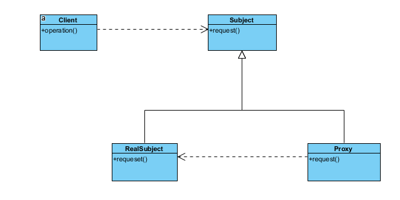

# 设计模式----结构型模式

[TOC]

结构型模式主要解决：如何组合类和对象以获得更大的结构。采用继承机制来组合接口或实现。

## 一、适配器（Adapter）

**目的**
将一个类的接口转换成客户希望的另一个接口。

当一个类使用另一个类时，如果所需假定条件越少，这个类就更具可复用性。

**结构类图**

## 二、桥接（Bridge）

**目的**
将抽象部分与它的实现部分分离，使它们都可以独立地变换。

继承机制使得客户代码与平台相关。

**结构类图**

**优点**

1. 分离接口及其实现部分
2. 提高可扩展性
3. 实现细节对客户透明

## 三、组合（Composite）

**目的**
将对象组合成树形结构以表示“部分-整体”的层次结构。

**结构类图**

## 四、装饰（Decorator）

**目的**

动态地给一个对象添加一些额外的职责。就增加功能来说，Decorator模式相比生成子类更为灵活。

**结构类图**

**优点**

1. 比静态继承更灵活
2. 避免在层次结构高层的类有太多的特征

**缺点**

1. Decorator与Component不一样；
2. 有许多小对象，学习难度增加

## 五、外观模式(Facade)

**目的**

为子系统中的一组接口提供一个一致的界面，Facade模式定义了一个高层接口，这个接口使得这一子系统更容易使用。

**结构类图**

**优点**

1. 屏蔽子系统组件，减少客户处理的对象数目，使子系统使用起来方便；
2. 子系统和客户之间松耦合

## 六、享元（Flyweight）

**目的**
运用共享技术有效的支持大量细粒度对象

**结构类图**

## 七、代理

**目的**
为其他对象提供一种代理以控制对这个对象的访问。

**结构类图**

**适用性**

1. 远程代理
2. 保护代理
3. 智能指引